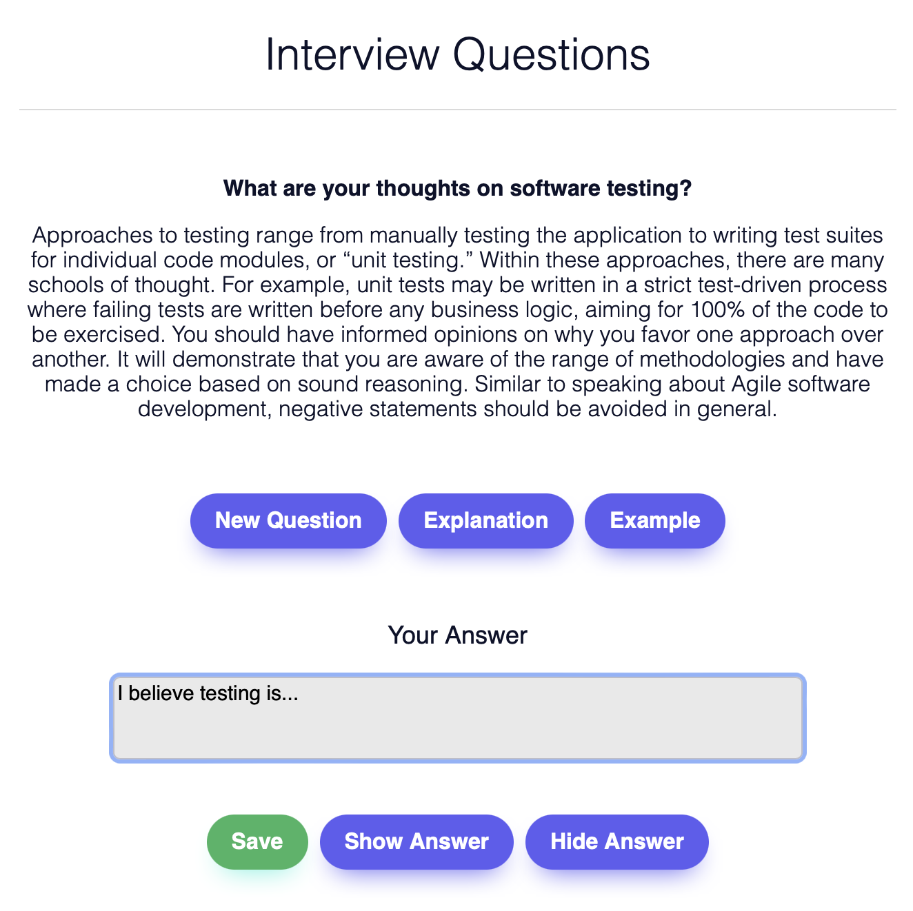

# Train Interview Questions

Get ready for a software interview with a curated list of questions accompanied by examples and explanations.
You are also able to store your answers and listen to the question being read by a text to speech software.



This project was built using Flask and Python. Tested on macOS Monterey 12.2.

## How to install
You will need Python 3 to work with this repository.
With pip, use:
```
python3 -m pip install -r requirements.txt
```

## How to run
In your terminal, simply run the main script
```
python3 main.py
```
Then, access the link provided in your terminal.

## Credits
Some of the examples and explanations were taken from different sources. Those include:
indeed.com
...

## License
MIT License.